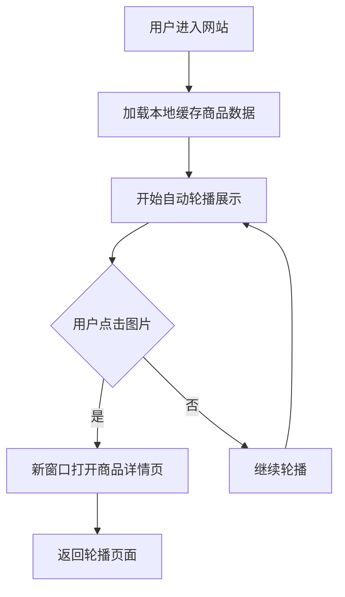
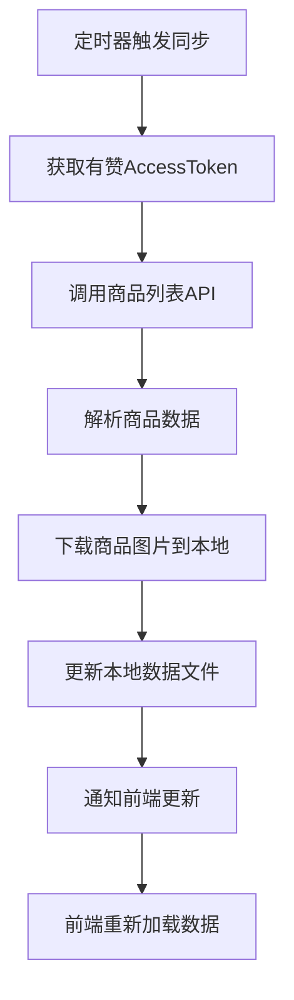
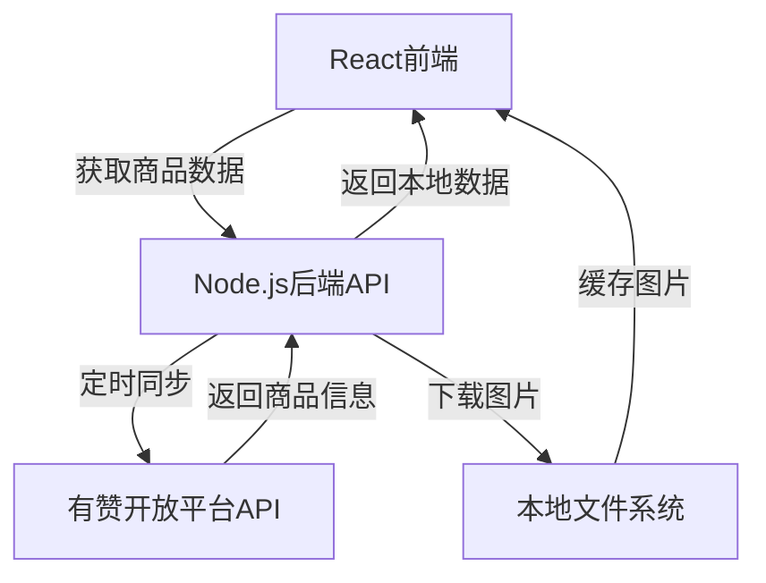

## 1. Product Overview

一个集成了有赞商店商品展示的智能图片轮播网站，支持自动同步商品信息、图片缓存和详情页跳转。

* 为商家提供自动化商品展示解决方案，通过精美的轮播效果展示商品并引导用户购买

* 支持定时同步有赞商店商品数据，自动下载商品图片到本地缓存，提升加载速度

* 适用于需要展示商品并引导销售的电商场景

## 2. Core Features

### 2.1 User Roles

| Role  | Registration Method | Core Permissions  |
| ----- | ------------------- | ----------------- |
| 访客用户  | 无需注册                | 浏览商品轮播、点击跳转到商品详情页 |
| 系统管理员 | 配置文件管理              | 配置有赞API参数、管理同步设置  |

### 2.2 Feature Module

网站包含以下核心页面和功能模块：

1. **主页面**: 商品图片轮播展示、自动切换、点击跳转、同步状态显示
2. **商品详情页**: 通过外部链接跳转到有赞商品详情页面

### 2.3 Page Details

| Page Name | Module Name | Feature description         |
| --------- | ----------- | --------------------------- |
| 主页面       | 商品轮播展示      | 自动轮播商品图片，3秒间隔，平滑过渡动画，支持点击暂停 |
| 主页面       | 商品信息展示      | 显示商品标题、价格、描述信息，轮播结束后淡入显示    |
| 主页面       | 商品链接跳转      | 点击图片直接跳转到有赞商品详情页面，新窗口打开     |
| 主页面       | 同步状态指示      | 显示最近同步时间、同步状态、错误提示信息        |
| 主页面       | 本地缓存优化      | 优先使用本地缓存图片，提升加载速度和用户体验      |
| 系统        | 定时自动同步      | 每30分钟自动同步有赞商品数据，支持手动触发同步    |
| 系统        | 图片本地存储      | 自动下载商品主图到本地，支持图片去重和智能命名     |
| 系统        | 配置管理        | 通过.env文件管理有赞API配置参数，支持多店铺配置 |

## 3. Core Process

### 3.1 用户浏览流程

### 3.2 商品同步流程

### 3.3 系统架构流程

## 4. User Interface Design

### 4.1 Design Style

* 主色调：现代深蓝色(#1E40AF)和纯净白色(#FFFFFF)

* 强调色：活力橙色(#F59E0B)用于重要按钮和状态指示

* 按钮样式：圆角矩形设计，悬停动画效果，现代化扁平化风格

* 字体：系统原生字体，标题20px加粗，正文16px，小标签14px

* 布局风格：全屏居中布局，卡片式展示，响应式设计

* 动画效果：平滑的淡入淡出过渡，优雅的加载动画

### 4.2 Page Design Overview

| Page Name | Module Name | UI Elements                            |
| --------- | ----------- | -------------------------------------- |
| 主页面       | 商品轮播区       | 全屏背景，商品图片居中展示，支持多种比例自适应，圆角边框，阴影效果      |
| 主页面       | 商品信息区       | 半透明背景面板，显示商品标题(大字体)、价格(彩色)、描述(灰色)，淡入动画 |
| 主页面       | 同步状态栏       | 顶部小标签显示最近同步时间，绿色表示正常，红色表示错误            |
| 主页面       | 加载动画        | 优雅的旋转加载器，半透明遮罩，加载完成自动消失                |
| 主页面       | 交互提示        | 鼠标悬停显示点击跳转提示，友好的用户引导                   |

### 4.3 Responsiveness

* 采用桌面优先设计策略，完美适配大屏幕展示

* 支持移动端自适应，确保手机和平板上的良好体验

* 图片和文字在不同屏幕尺寸下自动缩放优化

* 触摸设备优化，确保足够的点击区域和流畅的交互

* 支持横屏和竖屏模式，自动调整布局

## 5. Technical Features

### 5.1 后端服务特性

* **定时同步**：每30分钟自动执行商品数据同步

* **智能缓存**：本地文件缓存机制，减少API调用

* **错误处理**：完善的异常捕获和重试机制

* **多店铺支持**：支持配置多个有赞店铺信息

* **安全隔离**：前后端分离，API密钥后端安全存储

### 5.2 数据管理特性

* **本地存储**：商品信息和图片本地化管理

* **增量更新**：智能识别变更，减少不必要的数据传输

* **图片优化**：自动下载和缓存商品图片

* **数据验证**：完整的数据格式验证和清洗

### 5.3 性能优化特性

* **快速加载**：优先使用本地缓存，秒级响应

* **平滑动画**：硬件加速的CSS动画，流畅的用户体验

* **懒加载**：按需加载资源，优化初始加载时间

* **内存管理**：合理的资源释放，避免内存泄漏

