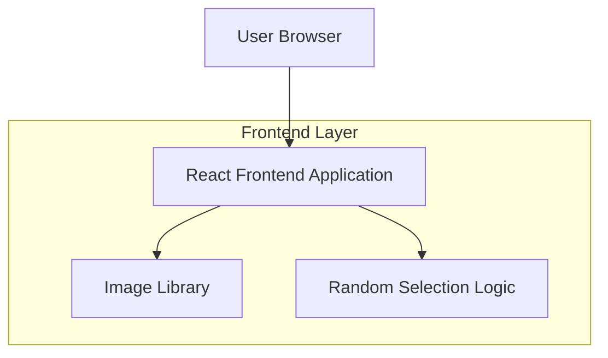

## 1. Architecture design

## 2. Technology Description
- Frontend: React@18 + tailwindcss@3 + vite
- Initialization Tool: vite-init
- Backend: None (纯前端应用)

## 3. Route definitions
| Route | Purpose |
|-------|---------|
| / | 主页面，显示图片和shuffle功能 |

## 4. 图片库管理
图片库将采用本地存储方式：
- 图片文件存储在项目的 `public/images/` 目录下
- 使用JSON配置文件记录图片信息（文件名、描述等）
- 支持至少10-20张图片的随机展示

## 5. 核心功能实现
### 5.1 随机选择算法
- 使用JavaScript的Math.random()生成随机索引
- 确保新选择的图片与当前图片不同
- 记录已显示历史，避免短时间内重复显示

### 5.2 图片加载优化
- 使用React的useState管理当前图片状态
- 图片预加载机制，提升用户体验
- 加载失败时显示默认占位图

## 6. 状态管理
- 使用React hooks进行状态管理
- 当前图片索引、图片库数据、加载状态等
- 无需复杂的全局状态管理工具